<p align="center">
  
  
  
  
  
  
  
</p>

<h1 align="center">Notify</h1>

<p align="center">
  Full-stack notification management system with async processing, multiple channels, and retry logic.
  <br />
  <a href="#getting-started"><strong>Explore the docs »</strong></a>
</p>

---

## Overview

**Notify** is a scalable, event-driven notification platform that enables sending **email**, **SMS**, and **push** notifications with scheduling, prioritization, and automatic retries. Built with Clean Architecture, it separates domain logic from infrastructure for maintainability and testability.

### Built With

| Layer | Stack |
|---|---|
| **Backend** | NestJS 11, TypeScript, Prisma ORM, PostgreSQL |
| **Frontend** | React 19, TypeScript, Vite, Tailwind CSS 4, shadcn/ui |
| **Message Queue** | RabbitMQ (AMQP) |
| **Email** | Nodemailer |
| **Auth** | JWT (RS256), Passport |
| **Infrastructure** | Docker, Docker Compose |

---

## Features

- **Multi-channel delivery** — Email, SMS, and Push notifications
- **Async processing** — RabbitMQ queue with prioritization and retry logic
- **Dead Letter Queue** — Failed messages after max retries are moved to DLQ
- **Notification templates** — Reusable templates with subject/body per channel
- **Recipient management** — CRUD, mass import, status control
- **Scheduling** — Schedule notifications for future delivery
- **Delivery logs** — Full audit trail with success/failure tracking
- **Authentication** — JWT-based login/register with session management
- **Dark/Light theme** — Built-in theme toggle via `next-themes`
- **API documentation** — Swagger UI + Scalar API Reference

---

## Architecture

```
┌──────────────────────────────────────────────────────────┐
│                    Frontend (React)                       │
│  ┌──────────┐ ┌──────────────┐ ┌────────────────────┐   │
│  │ Auth UI  │ │ Dashboard UI │ │ Management Pages   │   │
│  └────┬─────┘ └──────┬───────┘ └────────┬───────────┘   │
│       └──────────────┼──────────────────┘                │
└──────────────────────┼───────────────────────────────────┘
                       │ HTTP (REST)
┌──────────────────────┼───────────────────────────────────┐
│               Backend (NestJS)                            │
│  ┌────────────────────┴──────────────────────────────┐   │
│  │              Controllers (HTTP)                    │   │
│  └────────────────────┬──────────────────────────────┘   │
│  ┌────────────────────┴──────────────────────────────┐   │
│  │              Use Cases (Application)               │   │
│  └────────────────────┬──────────────────────────────┘   │
│  ┌────────────────────┴──────────────────────────────┐   │
│  │              Domain Entities                       │   │
│  └────────────────────┬──────────────────────────────┘   │
│  ┌────────────────────┴──────────────────────────────┐   │
│  │              Infrastructure Layer                  │   │
│  │  ┌──────────┐ ┌───────────┐ ┌────────────────┐  │   │
│  │  │ Prisma   │ │ RabbitMQ │ │ Nodemailer    │  │   │
│  │  │ (PG)     │ │ (Queue)  │ │ (SMTP)        │  │   │
│  │  └──────────┘ └───────────┘ └────────────────┘  │   │
│  └──────────────────────────────────────────────────┘   │
└──────────────────────────────────────────────────────────┘
```

### Data Flow

```
Client → Create Notification → Controller → Use Case
  → Save to DB (PENDING)
  → Publish to RabbitMQ Queue
  → Consumer picks up → Process Notification
  → Send via channel (Email/SMS/Push)
  → Update status (SENT/FAILED)
  → Log delivery attempt
  → If failed → Retry → DLQ after max retries
```

---

## Database Schema



**Models:**
- **User** — System users with JWT authentication
- **Recipient** — Notification targets (email, phone, push token)
- **Template** — Reusable notification templates per channel
- **Notification** — Core entity with status, priority, retries, scheduling
- **NotificationLog** — Delivery attempt audit trail

---

## Project Structure

```
notify-full/
├── notify-system/             # NestJS Backend
│   ├── prisma/                # Schema, migrations, ERD
│   ├── src/
│   │   ├── core/              # Base entities, cryptography interfaces
│   │   ├── domain/            # Business logic & use cases
│   │   │   ├── notification/  # Notification, logs, templates
│   │   │   ├── recipients/    # Recipient CRUD
│   │   │   └── users/         # Authentication & user management
│   │   └── infra/             # Controllers, DB, Queue, Mail, Auth
│   ├── test/                  # Unit & E2E tests
│   ├── docker-compose.yml
│   └── package.json
│
├── notify-frontend/           # React SPA
│   ├── src/
│   │   ├── components/        # UI components (auth, tables, forms)
│   │   ├── http/              # API client & type definitions
│   │   ├── layouts/           # Dashboard layout
│   │   ├── pages/             # Route pages (public & private)
│   │   └── lib/               # Utilities
│   ├── vite.config.ts
│   └── package.json
│
└── README.md
```

---

## Getting Started

### Prerequisites

- **Node.js** 18+
- **npm** 9+
- **Docker** & **Docker Compose** (for PostgreSQL and RabbitMQ)

### Installation

```bash
# Clone the repository
git clone https://github.com/your-username/notify-full.git
cd notify-full

# 1. Setup Backend
cd notify-system
cp .env .env.local   # Edit environment variables as needed
npm install
docker-compose up -d  # Start PostgreSQL + RabbitMQ
npx prisma migrate dev
npm run start:dev

# 2. Setup Frontend (in a new terminal)
cd notify-frontend
npm install
npm run dev
```

### Environment Variables

| Variable | Description |
|---|---|
| `PORT` | Backend server port (default: `3333`) |
| `DATABASE_URL` | PostgreSQL connection string |
| `RABBITMQ_URL` | RabbitMQ AMQP URL |
| `JWT_PRIVATE_KEY` | RSA private key for JWT signing (base64) |
| `JWT_PUBLIC_KEY` | RSA public key for JWT verification (base64) |
| `SMTP_HOST` | SMTP server host |
| `SMTP_PORT` | SMTP server port |
| `SMTP_USER` | SMTP username |
| `SMTP_PASS` | SMTP password |

---

## Running the Project

### Backend

```bash
cd notify-system

npm run start:dev      # Development (watch mode)
npm run start:prod     # Production
npm run build          # Compile
npx prisma studio      # Prisma GUI (port 5555)
```

### Frontend

```bash
cd notify-frontend

npm run dev            # Development server (port 5173)
npm run build          # Production build
npm run preview        # Preview production build
```

### Infrastructure

```bash
cd notify-system
docker-compose up -d   # PostgreSQL (5433) + RabbitMQ (5672, 15672)
```

---

## API Documentation

- **Swagger UI** — `http://localhost:3333/swagger`
- **Scalar API Reference** — `http://localhost:3333/docs`

### Main Endpoints

| Resource | Endpoints |
|---|---|
| **Auth** | `POST /auth/login`, `POST /auth/register`, `POST /auth/logout` |
| **Notifications** | `GET/POST /notifications`, `DELETE /notifications/:id` |
| **Templates** | `GET/POST /templates`, `GET/PUT/DELETE /templates/:id` |
| **Recipients** | `GET/POST /recipients`, `GET/PUT/DELETE /recipients/:id` |
| **Logs** | `GET /notification-logs` |
| **Profile** | `GET /me` |

---

## Testing

### Backend

```bash
cd notify-system

npm run test           # Unit tests
npm run test:watch     # Watch mode
npm run test:cov       # Coverage report
npm run test:e2e       # End-to-end tests
```

---

## License

This project is **UNLICENSED** — all rights reserved.
